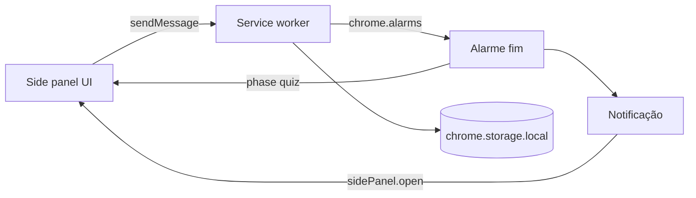

# Learn in Pomodoro — MVP só como extensão (Manifest V3)

## Nome do produto

**Learn in Pomodoro** — usar em `manifest.json` (`name` / `short_name`), ícone, descrição na Chrome Web Store e textos da UI quando fizer sentido.

## Produto (uma frase)

Extensão de browser: **sessão de foco com temporizador**; ao terminar, **revisão rápida** (perguntas estilo flashcard) com conteúdo guardado na extensão.

## UI principal: Side Panel (painel lateral), não popup

O **popup** da extensão fecha com facilidade e tem pouco espaço — **não é a superfície principal** do MVP.

- **Superfície principal**: **Side Panel** (`chrome.sidePanel` — o "painel lateral" do Chrome/Edge). Mais espaço para timer, quiz, lista e formulários de estudo.
- **Abrir o painel**: configurar **`openPanelOnActionClick: true`** para um clique no **ícone da toolbar** abrir diretamente o side panel (sem depender de um popup intermédio).
- **Após notificação** de fim de sessão: no handler (ex. `notifications.onClicked`), chamar **`chrome.sidePanel.open({ windowId })`** para trazer o utilizador ao painel com o quiz.

## Regra de UX: fecho só com ação explícita

- **Dentro da extensão**: não usar padrões do tipo **"clicar fora / no fundo escuro fecha o modal"** para ecrãs importantes (quiz, confirmações, formulários). O fecho ou conclusão deve ser por **botão explícito** (ex. "Fechar", "Concluir", "Guardar").
- **Overlays e diálogos**: se existirem, o backdrop **não** deve ser clicável para dispensar; apenas os botões da barra de ações.
- **Limite do browser**: o Chrome pode mostrar **controlo nativo** do painel lateral (recolher / fechar painel). Isso não se remove por API; o que ficas a garantir é o comportamento **dentro do teu HTML/React** — previsível e sem fechos acidentais por "fora" da área útil.

## Fluxo do MVP



## Porque o estado vive no service worker

O **side panel** também **não fica sempre montado** (pode ser fechado/recolhido). A **fonte da verdade** continua no worker + `chrome.storage.local`:

- `endTime`, `running` / `paused`, `phase` (`idle` | `focusing` | `quiz_pending`).
- Gatilho real do fim: **`chrome.alarms`** → notificação + atualizar `phase`.
- Ao **abrir** o painel, a UI lê o estado (mensagem ao worker ou `storage`) e desenha o temporizador / quiz.

**Limite**: com **todas** as janelas do browser fechadas, o alarme normalmente **não** corre até voltares a abrir o navegador.

## Modelo de dados (chrome.storage.local)

```ts
// Categoria de estudo
interface Category {
  id: string        // nanoid
  name: string
  createdAt: number // timestamp ms
}

// Flashcard / pergunta
interface Question {
  id: string
  categoryId: string
  prompt: string         // enunciado / frente do card
  answer: string         // resposta / verso do card
  difficulty: 'easy' | 'medium' | 'hard'  // definido no cadastro; usado para filtrar no Modo Focado
  createdAt: number
}

// Estado do timer (já implementado)
interface TimerState {
  phase: 'idle' | 'focusing' | 'quiz_pending'
  endTime: number | null
  timeLeft: number
  running: boolean
}
```

**Nota de design**: a `difficulty` é uma propriedade da pergunta, definida no momento do cadastro — **não é uma avaliação feita pelo utilizador durante o quiz**. O seu uso é exclusivamente para filtrar perguntas no **Modo Focado** (futuro).

## Navegação (telas)

O side panel tem um **bottom nav** com as seguintes telas:

| Ícone | Label | Rota | Estado |
|-------|-------|------|--------|
| Timer | Timer | `timer` | ✅ feito |
| BookOpen | Perguntas | `questions` | 🔲 a fazer |
| Tag | Categorias | `categories` | 🔲 a fazer |

A tela de **Quiz** (`quiz`) é ativada automaticamente quando `phase === 'quiz_pending'` — não aparece no menu.

## Modo Focado (futuro — pós-MVP)

Sessão de treino sem pomodoro: o utilizador acede diretamente ao quiz, podendo filtrar por **categoria** e **dificuldade** (easy / medium / hard). Acessível a partir do menu como uma quarta opção.

## `manifest.json` (essencial com Side Panel)

- `manifest_version`: 3
- `name`, `version`, `description`, `icons`
- `side_panel.default_path`: ex. `sidepanel.html`
- `background.service_worker`: worker único (bundled)
- `permissions`: `storage`, `alarms`, `notifications`, `sidePanel`

## Passos de implementação

1. ✅ **Build**: Vite com entradas **`sidepanel`** + **`background`**
2. ✅ **Manifest** com `side_panel`, permissões, ícones
3. ✅ **Abertura**: `chrome.sidePanel.setPanelBehavior({ openPanelOnActionClick: true })`
4. ✅ **Worker**: `chrome.alarms`, persistência, `onAlarm` → notificação + `quiz_pending`
5. ✅ **Side panel — timer**: iniciar / pausar / reset / skip; seletor de categoria
6. ✅ **Navegação**: bottom nav com Timer, Perguntas e Categorias
7. 🔲 **Tela Categorias**: CRUD de categorias em `chrome.storage.local`
8. 🔲 **Tela Perguntas**: CRUD de flashcards com dificuldade e categoria
9. 🔲 **Side panel — quiz** pós-pomodoro: exibe pergunta da categoria ativa
10. 🔲 **Testes**: alarme com painel fechado; clicar notificação abre painel no quiz

## Checklist rápido de validação

- Alarme dispara com painel **fechado** e browser **aberto**.
- Clique no ícone abre o **side panel** (sem depender de popup principal).
- Estado correto ao reabrir o painel (lido do `storage` / worker).
- Nenhum overlay crítico fecha ao clicar "fora" (só botões explícitos).

## Depois do MVP (ainda extensão)

- Modo Focado (quiz sem pomodoro, filtro por dificuldade)
- Import/export JSON; sons; estatísticas; polish visual; submissão à Chrome Web Store.

**Stack**: Vite + TypeScript + React — bundles **sidepanel** + **service worker**.
