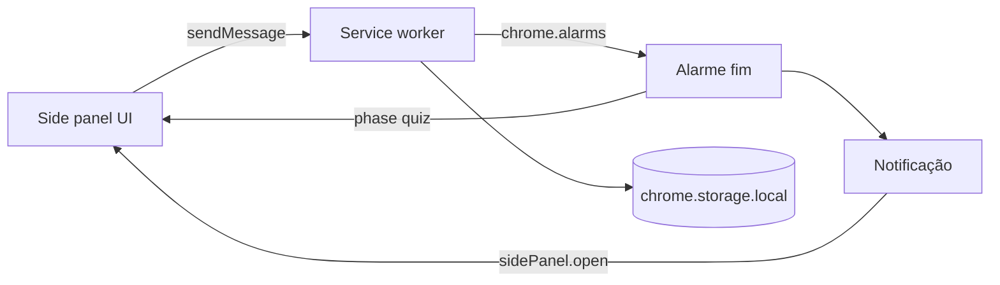

# Learn in Pomodoro — MVP só como extensão (Manifest V3)

## Nome do produto

**Learn in Pomodoro** — usar em `manifest.json` (`name` / `short_name`), ícone, descrição na Chrome Web Store e textos da UI quando fizer sentido.

## Produto (uma frase)

Extensão de browser: **sessão de foco com temporizador**; ao terminar, **revisão rápida** (perguntas estilo flashcard / múltipla escolha) com conteúdo guardado na extensão.

## UI principal: Side Panel (painel lateral), não popup

O **popup** da extensão fecha com facilidade e tem pouco espaço — **não é a superfície principal** do MVP.

- **Superfície principal**: **Side Panel** (`chrome.sidePanel` — o “painel lateral” do Chrome/Edge). Mais espaço para timer, quiz, lista e formulários de estudo.
- **Abrir o painel**: configurar **`openPanelOnActionClick: true`** para um clique no **ícone da toolbar** abrir diretamente o side panel (sem depender de um popup intermédio).
- **Após notificação** de fim de sessão: no handler (ex. `notifications.onClicked`), chamar **`chrome.sidePanel.open({ windowId })`** para trazer o utilizador ao painel com o quiz.

## Regra de UX: fecho só com ação explícita

- **Dentro da extensão**: não usar padrões do tipo **“clicar fora / no fundo escuro fecha o modal”** para ecrãs importantes (quiz, confirmações, formulários). O fecho ou conclusão deve ser por **botão explícito** (ex. “Fechar”, “Concluir”, “Guardar”).
- **Overlays e diálogos**: se existirem, o backdrop **não** deve ser clicável para dispensar; apenas os botões da barra de ações.
- **Limite do browser**: o Chrome pode mostrar **controlo nativo** do painel lateral (recolher / fechar painel). Isso não se remove por API; o que ficas a garantir é o comportamento **dentro do teu HTML/React** — previsível e sem fechos acidentais por “fora” da área útil.

## Fluxo do MVP

## Porque o estado vivo no service worker

O **side panel** também **não fica sempre montado** (pode ser fechado/recolhido). A **fonte da verdade** continua no worker + `chrome.storage.local`:

- `endTime`, `running` / `paused`, `phase` (`idle` | `focusing` | `quiz_pending`).
- Gatilho real do fim: **`chrome.alarms`** → notificação + atualizar `phase`.
- Ao **abrir** o painel, a UI lê o estado (mensagem ao worker ou `storage`) e desenha o temporizador / quiz.

**Limite**: com **todas** as janelas do browser fechadas, o alarme normalmente **não** corre até voltares a abrir o navegador.

## `manifest.json` (essencial com Side Panel)

- `manifest_version`: 3
- `name`, `version`, `description`, `icons`
- `side_panel.default_path`: ex. `sidepanel.html` (documento principal do painel)
- **Evitar** `action.default_popup` no MVP se quiseres **só** “clique no ícone → abre painel”; caso contrário, um popup **mínimo** só com “Abrir painel” é redundante se `openPanelOnActionClick` estiver ativo.
- `background.service_worker`: worker único (bundled)
- `permissions`: `storage`, `alarms`, `notifications`, `sidePanel`
- Opcional mais tarde: `options_page` para preferências avançadas (o CRUD de cartões pode viver no próprio painel pelo espaço extra)

## Dados no MVP

Em `chrome.storage.local`:

- `items`: array de `{ id, prompt, choices[], correctIndex }` (ou evoluir depois).
- Estado de sessão: `endTime`, `phase`, etc.

Sem servidor no MVP.

## Passos de implementação (ordem direta)

1. **Build**: Vite com entradas **`sidepanel`** + **`background`**, output pronto para “Carregar sem empacotar”.
2. **Manifest** com `side_panel`, permissões, ícones; página `sidepanel` a comunicar com o worker (ping/pong).
3. **Abertura**: no `service_worker`, ao instalar ou em runtime, `chrome.sidePanel.setPanelBehavior({ openPanelOnActionClick: true })`.
4. **Worker**: `chrome.alarms`, persistência, `onAlarm` → notificação + `quiz_pending`; handler de clique na notificação → `sidePanel.open`.
5. **Side panel — timer**: iniciar / pausar / reset; subscrição ao estado; badge opcional na ação.
6. **Side panel — quiz** após alarme; **CRUD** de itens na mesma vista ou secção com scroll.
7. **UX**: implementar fechos **só por botão** em modais/overlays; revisar que nenhum `onClick` no overlay fecha o conteúdo.
8. **Testes**: alarme com painel **fechado**; clicar notificação abre painel no quiz; inspecionar worker.

## Checklist rápido de validação

- Alarme dispara com painel **fechado** e browser **aberto**.
- Clique no ícone abre o **side panel** (sem depender de popup principal).
- Estado correto ao reabrir o painel (lido do `storage` / worker).
- Nenhum overlay crítico fecha ao clicar “fora” (só botões explícitos).

## Depois do MVP (ainda extensão)

- Import/export JSON; sons; estatísticas; polish visual; submissão à Chrome Web Store.

**Stack sugerida**: Vite + TypeScript + React (ou Svelte) — bundles **sidepanel** + **service worker** e paths corretos no manifest.
