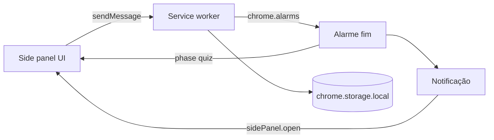

# Learn in Pomodoro — MVP só como extensão (Manifest V3)

## Nome do produto

**Learn in Pomodoro** — usar em `manifest.json` (`name` / `short_name`), ícone, descrição na Chrome Web Store e textos da UI quando fizer sentido.

## Produto (uma frase)

Extensão de browser: **sessão de foco com temporizador**; ao terminar, **revisão rápida** (perguntas estilo flashcard) com conteúdo guardado na extensão.

## UI principal: Side Panel (painel lateral), não popup

O **popup** da extensão fecha com facilidade e tem pouco espaço — **não é a superfície principal** do MVP.

- **Superfície principal**: **Side Panel** (`chrome.sidePanel` — o "painel lateral" do Chrome/Edge). Mais espaço para timer, quiz, lista e formulários de estudo.
- **Abrir o painel**: configurar **`openPanelOnActionClick: true`** para um clique no **ícone da toolbar** abrir diretamente o side panel (sem depender de um popup intermédio).
- **Após notificação** de fim de sessão: no handler (ex. `notifications.onClicked`), chamar **`chrome.sidePanel.open({ windowId })`** para trazer o utilizador ao painel com o quiz.

## Regra de UX: fecho só com ação explícita

- **Dentro da extensão**: não usar padrões do tipo **"clicar fora / no fundo escuro fecha o modal"** para ecrãs importantes (quiz, confirmações, formulários). O fecho ou conclusão deve ser por **botão explícito** (ex. "Fechar", "Concluir", "Guardar").
- **Overlays e diálogos**: se existirem, o backdrop **não** deve ser clicável para dispensar; apenas os botões da barra de ações.
- **Limite do browser**: o Chrome pode mostrar **controlo nativo** do painel lateral (recolher / fechar painel). Isso não se remove por API; o que ficas a garantir é o comportamento **dentro do teu HTML/React** — previsível e sem fechos acidentais por "fora" da área útil.

## Fluxo do MVP



## Porque o estado vive no service worker

O **side panel** também **não fica sempre montado** (pode ser fechado/recolhido). A **fonte da verdade** continua no worker + `chrome.storage.local`:

- `endTime`, `running` / `paused`, `phase` (`idle` | `focusing` | `quiz_pending`).
- Gatilho real do fim: **`chrome.alarms`** → notificação + atualizar `phase`.
- Ao **abrir** o painel, a UI lê o estado (mensagem ao worker ou `storage`) e desenha o temporizador / quiz.

**Limite**: com **todas** as janelas do browser fechadas, o alarme normalmente **não** corre até voltares a abrir o navegador.

## Modelo de dados (chrome.storage.local)

```ts
// Categoria de estudo
interface Category {
  id: string        // nanoid
  name: string
  createdAt: number // timestamp ms
}

// Flashcard / pergunta
interface Question {
  id: string
  categoryId: string
  prompt: string         // enunciado / frente do card
  answer: string         // resposta / verso do card
  difficulty: 'easy' | 'medium' | 'hard'  // definido no cadastro; usado para filtrar no Modo Focado
  createdAt: number
}

// Estado do timer (já implementado)
interface TimerState {
  phase: 'idle' | 'focusing' | 'quiz_pending'
  endTime: number | null
  timeLeft: number
  running: boolean
}
```

**Nota de design**: a `difficulty` é uma propriedade da pergunta, definida no momento do cadastro — **não é uma avaliação feita pelo utilizador durante o quiz**. O seu uso é exclusivamente para filtrar perguntas no **Modo Focado** (futuro).

## Navegação (telas)

O side panel tem um **bottom nav** com as seguintes telas:

| Ícone | Label | Rota | Estado |
|-------|-------|------|--------|
| Timer | Timer | `timer` | ✅ feito |
| BookOpen | Perguntas | `questions` | ✅ feito |
| Tag | Categorias | `categories` | ✅ feito |
| Coffee | Pomodoro | `pomodoro` | ✅ feito |

A tela de **Quiz** (`quiz`) é ativada automaticamente quando `phase === 'quiz_pending'` — não aparece no menu.

## Modo Focado (futuro — pós-MVP)

Sessão de treino sem pomodoro: o utilizador acede diretamente ao quiz, podendo filtrar por **categoria** e **dificuldade** (easy / medium / hard). Acessível a partir do menu como uma quarta opção.

## `manifest.json` (essencial com Side Panel)

- `manifest_version`: 3
- `name`, `version`, `description`, `icons`
- `side_panel.default_path`: ex. `sidepanel.html`
- `background.service_worker`: worker único (bundled)
- `permissions`: `storage`, `alarms`, `notifications`, `sidePanel`

## Passos de implementação

1. ✅ **Build**: Vite com entradas **`sidepanel`** + **`background`**
2. ✅ **Manifest** com `side_panel`, permissões, ícones
3. ✅ **Abertura**: `chrome.sidePanel.setPanelBehavior({ openPanelOnActionClick: true })`
4. ✅ **Worker**: `chrome.alarms`, persistência, `onAlarm` → notificação + `quiz_pending`
5. ✅ **Side panel — timer**: iniciar / pausar / reset / skip; seletor de categoria; card de pré-visualização do pomodoro com lista numerada de perguntas
6. ✅ **Navegação**: bottom nav com Timer, Perguntas, Categorias e Pomodoro
7. ✅ **Tela Categorias**: CRUD com nome, cor e emoji; dialog de confirmação de exclusão
8. ✅ **Tela Perguntas**: CRUD de flashcards múltipla escolha (A/B/C/D); filtro por categoria
9. ✅ **Tela Pomodoro**: CRUD; seleção de perguntas por categoria; "Selecionar todas"
10. ✅ **Side panel — quiz** pós-pomodoro: rodada de até 5 perguntas, 1min cada, auto-avanço, reveal de resposta, reinício automático do foco
11. ✅ **Lift state**: unificar Categorias, Perguntas e Pomodoros no App.tsx; cascade delete; persistir answeredIds entre sessões
12. ✅ **UX polish**: difficulty nas perguntas, empty states, toasts CRUD, indicador de posição, botão Login desabilitado
13. ✅ **QA E2E com Playwright**: 21 testes passando — empty states, CRUD, timer, troca de pomodoro, persistência
14. ✅ **Bug fixes pós-Playwright**: arco coral sem clamp (girava loucamente), play ativo com pomodoro concluído, timer ignorava duração do pomodoro no arranque
15. ✅ **Isolamento E2E**: RESET ao worker no fixture cancela alarmes pendentes entre testes
16. ✅ **QA alarme com painel fechado** — testado e funcionando
17. ✅ **Slug único para Categorias e Pomodoros**: campo slug editável, validação de duplicata, crypto.randomUUID(), migration de dados legacy
18. 🔲 **Tela de Importação**: nova tela no menu, JSON com slugs, pré-visualização do que será criado, confirmação antes de importar
18. 🔲 **Publicar na Chrome Web Store**: ver secção abaixo ← próximo passo

## Checklist rápido de validação

- ✅ **Playwright E2E** — 21/21 passando (empty states, CRUD, timer, persistência)
- ✅ **Bug fixes pós-Playwright** — arco coral, play com pomodoro concluído, duração no arranque
- ✅ **Isolamento E2E** — RESET enviado ao worker no fixture antes do clear() para cancelar alarmes pendentes
- ✅ **Alarme dispara com painel fechado** — testado e funcionando
  - Simular com 30s via DevTools do service worker (`chrome://extensions` → Inspect worker):
    ```js
    chrome.storage.local.set({ timerState: { phase: 'focusing', running: true, endTime: Date.now() + 30000, timeLeft: 30 } })
    chrome.alarms.create('pomodoro', { when: Date.now() + 30000 })
    ```
  - Fechar o side panel → aguardar → notificação deve aparecer → clicar → quiz deve abrir
- Clique no ícone abre o **side panel** (sem depender de popup principal).
- Estado correto ao reabrir o painel (lido do `storage` / worker).
- Nenhum overlay crítico fecha ao clicar "fora" (só botões explícitos).

## Depois do MVP (ainda extensão)

- Modo Focado (quiz sem pomodoro, filtro por dificuldade)
- Import/export JSON; sons; estatísticas; polish visual; submissão à Chrome Web Store.

**Stack**: Vite + TypeScript + React — bundles **sidepanel** + **service worker**.

## Publicar na Chrome Web Store

### Pré-requisitos
- Conta de developer Google: https://chrome.google.com/webstore/devconsole — taxa única de **$5 USD**
- Build de produção limpa: `npm run build` → pasta `dist/`

### Ativos necessários
| Item | Especificação |
|------|--------------|
| Ícone da extensão | 128×128 px PNG (já no `manifest.json`) |
| Screenshots | Mínimo 1, máximo 5 — **1280×800** ou **640×400** px |
| Ícone da store | 128×128 px (pode ser o mesmo do manifest) |
| Descrição curta | até 132 caracteres |
| Descrição longa | até 16 000 caracteres |

### Passos
1. `npm run build` — gera `dist/`
2. Zipar a pasta `dist/` inteira (não a raiz do projeto) → `learn-in-pomodoro.zip`
3. Entrar no [Chrome Web Store Developer Dashboard](https://chrome.google.com/webstore/devconsole)
4. **New Item** → fazer upload do `.zip`
5. Preencher ficha: nome, descrição, categoria (Productivity), screenshots, região
6. **Privacy**: declarar que não coleta dados de utilizador (extensão é 100% local)
7. Submeter para revisão — prazo típico: **1–3 dias úteis**

### Observações
- A revisão pode pedir justificativa para cada permissão (`storage`, `alarms`, `notifications`, `sidePanel`) — prepare um parágrafo curto explicando o uso de cada uma
- Após aprovação, atualizações são publicadas com novo `.zip` + bump de versão no `manifest.json`
